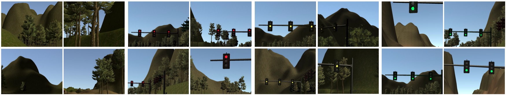
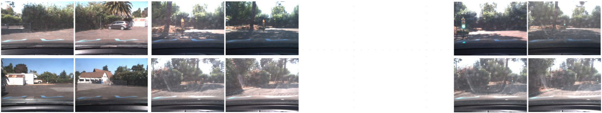

# Traffic Light Classifier

Simple traffic light classifier to be integrated in the capstone project.

---

## Dataset

### Simulator dataset
**Number of frames:** 1324 frames

**Resolution:** 800x600 pixel

**Classes:** {none, red, yellow, green}

**Samples:**

### Udacity circuit dataset
**Number of frames:** 1151 frames

**Resolution:** 800x600 pixel

**Classes:** {none, red, green}

**Samples:**

### Mixed dataset

The network has been from the dataset obtained merging the two dataset above.

### Downloading the data

All three datasets are available in this [shared folder](https://drive.google.com/open?id=0Bx9YaGcDPu3XSlMxeHlPZEIyRzQ).

## Project Structure

- [`train.py`](https://github.com/ndrplz/self-driving-car/blob/master/capstone_traffic_light_classifier/train.py): entry point for training the model
- [`test.py`](https://github.com/ndrplz/self-driving-car/blob/master/capstone_traffic_light_classifier/test.py): entry point for testing the model from pretrained weights
- [`traffic_light_dataset.py`](https://github.com/ndrplz/self-driving-car/blob/master/capstone_traffic_light_classifier/traffic_light_dataset.py): contains`TrafficLightDataset` class to abstract over the raw data
- [`traffic_light_classifier.py`](https://github.com/ndrplz/self-driving-car/blob/master/capstone_traffic_light_classifier/traffic_light_classifier.py): contains `TrafficLightClassifier` deep network for classification
