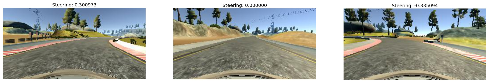
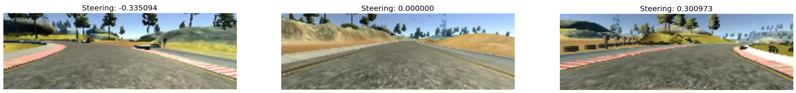
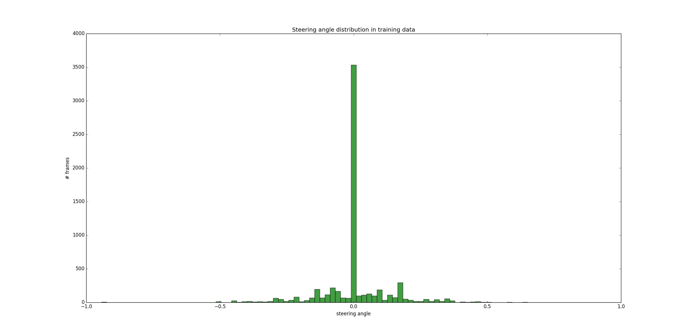
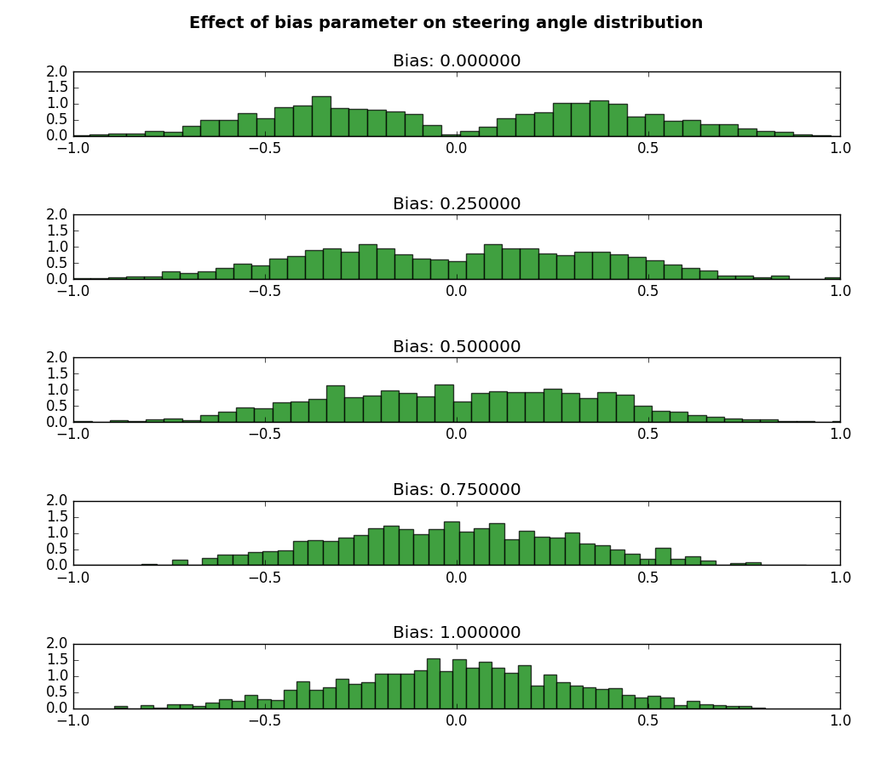

# Project 3 - Behavioral Cloning

#### Demo here:

## Goal
The goal of the project was to train a Deep Network to replicate the human steering behavior while driving, thus being able to drive autonomously on a simulator provided by [Udacity](https://www.udacity.com/). To this purpose, the network takes as input the frame of the frontal camera (say, a roof-mounted camera) and predicts the steering direction at each instant.

## The dataset
Data for this task can be gathered with the Udacity simulator itself. Indeed, when the simulator is set to *training mode*, the car is controlled by the human though the keyboard, and frames and steering directions are stored to disk. For those who want to avoid this process, Udacity made also available an "off-the-shelf" training set. For this project, I employed this latter.

Udacity training set is constituted by 8036 samples. For each sample, two main information are provided:
- three frames from the frontal, left and right camera respectively
- the corresponding steering direction

### Visualizing training data

Here's how a typical sample looks like. We have three frames from different cameras as well as the associated steering direction.

First things first, every frame is preprocessed by cropping the upper and lower part of the frame: in this way we discard information that is probably useless for the task of predicting the steering direction. Now our input frames look like these: 

As we see, each frame is associated to a certain steering angle. Unfortunately, there's a huge skew in the ground truth data distribution: as we can see the steering angle distribution is strongly biased towards the zero.

### Data Augmentation

effect of bias parameter on a generated batch

## Network architecture
### Model architecture
### Preventing overfitting
### Training Details

## Testing the model
### Discussion
