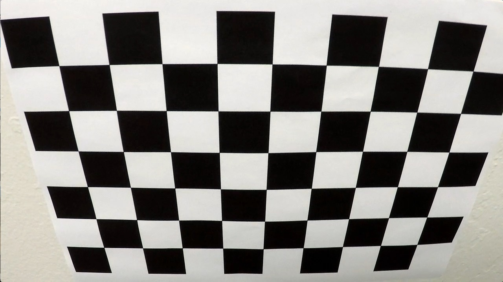
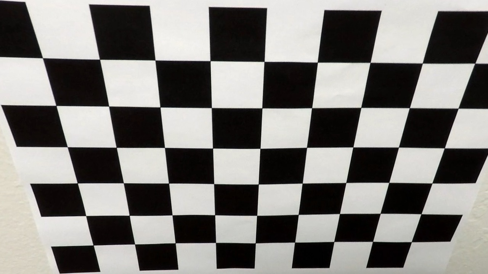
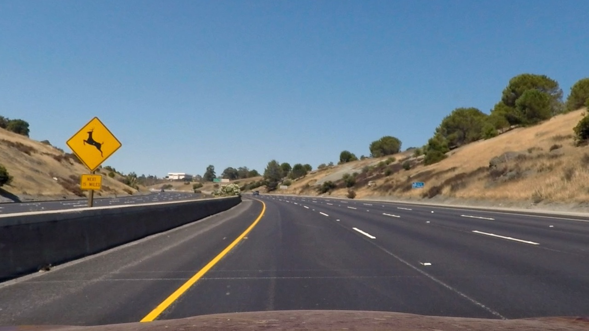
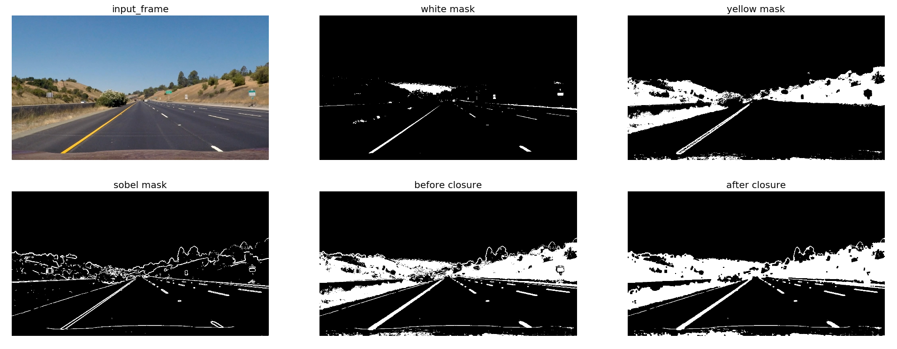
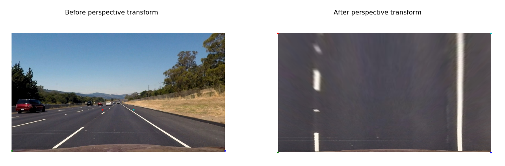

# Project 4 - Advanced Lane Finding

<p align="center">
 <a href="https://www.youtube.com/watch?v=g5BhDtoheE4"></a>
 <br>Qualitative results. (click for full video)
</p>

---

**Advanced Lane Finding Project**

The goals / steps of this project are the following:

* Compute the camera calibration matrix and distortion coefficients given a set of chessboard images.
* Apply a distortion correction to raw images.
* Use color transforms, gradients, etc., to create a thresholded binary image.
* Apply a perspective transform to rectify binary image ("birds-eye view").
* Detect lane pixels and fit to find the lane boundary.
* Determine the curvature of the lane and vehicle position with respect to center.
* Warp the detected lane boundaries back onto the original image.
* Output visual display of the lane boundaries and numerical estimation of lane curvature and vehicle position.

[//]: # (Image References)

[img_overview]: ./img/overview.gif "Output Overview"


## [Rubric](https://review.udacity.com/#!/rubrics/571/view)

### Camera Calibration

OpenCV provide some really helpful built-in functions for the task on camera calibration. First of all, to detect the calibration pattern in the [calibration images](./camera_cal/), we can use the function `cv2.findChessboardCorners(image, pattern_size)`. 

Once we have stored the correspondeces between 3D world and 2D image points for a bunch of images, we can proceed to actually calibrate the camera through `cv2.calibrateCamera()`. Among other things, this function returns both the *camera matrix* and the *distortion coefficients*, which we can use to undistort the frames.

The code for this steps can be found in [calibration_utils](calibration_utils.py).   

I applied this distortion correction to the test image using the `cv2.undistort()` function and obtained the following result (appreciating the effect of calibration is easier on the borders of the image): 

<table style="width:100%">
  <tr>
    <th>
      <p align="center">
           
           <br>Chessboard image before calibration
      </p>
    </th>
    <th>
      <p align="center">
           
           <br>Chessboard image after calibration
      </p>
    </th>
  </tr>
</table>

###Pipeline (single images)

####1. Provide an example of a distortion-corrected image.

Once the camera is calibrated, we can use the camera matrix and distortion coefficients we found to undistort also the test images. Indeed, if we want to study the *geometry* of the road, we have to be sure that the images we're processing do not present distortions. Here's the result of distortion-correction on one of the test images:

<table style="width:100%">
  <tr>
    <th>
      <p align="center">
           
           <br>Test image before calibration
      </p>
    </th>
    <th>
      <p align="center">
           
           <br>Test image after calibration
      </p>
    </th>
  </tr>
</table>

In this case appreciating the result is slightly harder, but we can notice nonetheless some difference on both the very left and very right side of the image.

####2. Describe how (and identify where in your code) you used color transforms, gradients or other methods to create a thresholded binary image.  Provide an example of a binary image result.

Correctly creating the binary image from the input frame is the very first step of the whole pipeline that will lead us to detect the lane. For this reason, I found that is also one of the most important. If the binary image is bad, it's very difficult to recover and to obtain good results in the successive steps of the pipeline. The code related to this part can be found [here](./binarization_utils.py).

I used a combination of color and gradient thresholds to generate a binary image. In order to detect the white lines, I found that [equalizing the histogram](http://docs.opencv.org/3.1.0/d5/daf/tutorial_py_histogram_equalization.html) of the input frame before thresholding works really well to highlight the actual lane lines. For the yellow lines, I employed a threshold on V channel in [HSV](http://docs.opencv.org/3.2.0/df/d9d/tutorial_py_colorspaces.html) color space. Furthermore, I also convolve the input frame with Sobel kernel to get an estimate of the gradients of the lines. Finally, I make use of [morphological closure](http://docs.opencv.org/3.0-beta/doc/py_tutorials/py_imgproc/py_morphological_ops/py_morphological_ops.html) to *fill the gaps* in my binary image. Here I show every substep and the final output:
<p align="center">
  
</p>

####3. Describe how (and identify where in your code) you performed a perspective transform and provide an example of a transformed image.

Code relating to warping between the two perspective can be found [here](./perspective_utils.py). The function `calibration_utils.birdeye()` takes as input the frame (either color or binary) and returns the bird's-eye view of the scene. In order to perform the perspective warping, we need to map 4 points in the original space and 4 points in the warped space. For this purpose, both source and destination points are *hardcoded* (ok, I said it) as follows:

```
    h, w = img.shape[:2]

    src = np.float32([[w, h-10],    # br
                      [0, h-10],    # bl
                      [546, 460],   # tl
                      [732, 460]])  # tr
    dst = np.float32([[w, h],       # br
                      [0, h],       # bl
                      [0, 0],       # tl
                      [w, 0]])      # tr

```

I verified that my perspective transform was working as expected by drawing the `src` and `dst` points onto a test image and its warped counterpart to verify that the lines appear parallel in the warped image.

<p align="center">
  
</p>

####4. Describe how (and identify where in your code) you identified lane-line pixels and fit their positions with a polynomial?

Then I did some other stuff and fit my lane lines with a 2nd order polynomial kinda like this:

![alt text][image5]

####5. Describe how (and identify where in your code) you calculated the radius of curvature of the lane and the position of the vehicle with respect to center.

I did this in lines # through # in my code in `my_other_file.py`

####6. Provide an example image of your result plotted back down onto the road such that the lane area is identified clearly.

I implemented this step in lines # through # in my code in `yet_another_file.py` in the function `map_lane()`.  Here is an example of my result on a test image:

![alt text][image6]

---

###Pipeline (video)

####1. Provide a link to your final video output.  Your pipeline should perform reasonably well on the entire project video (wobbly lines are ok but no catastrophic failures that would cause the car to drive off the road!).

Here's a [link to my video result](./project_video.mp4)

---

###Discussion

####1. Briefly discuss any problems / issues you faced in your implementation of this project.  Where will your pipeline likely fail?  What could you do to make it more robust?

Here I'll talk about the approach I took, what techniques I used, what worked and why, where the pipeline might fail and how I might improve it if I were going to pursue this project further.  

