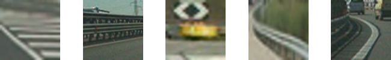
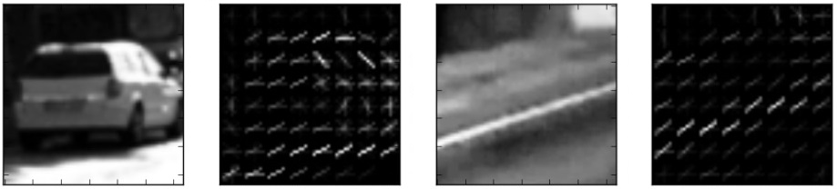
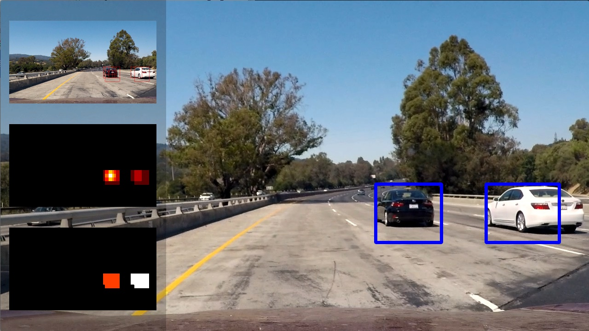
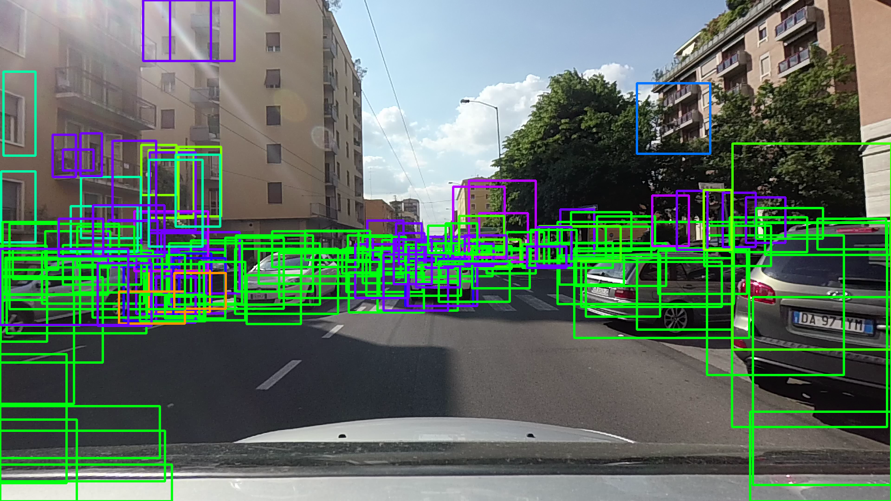
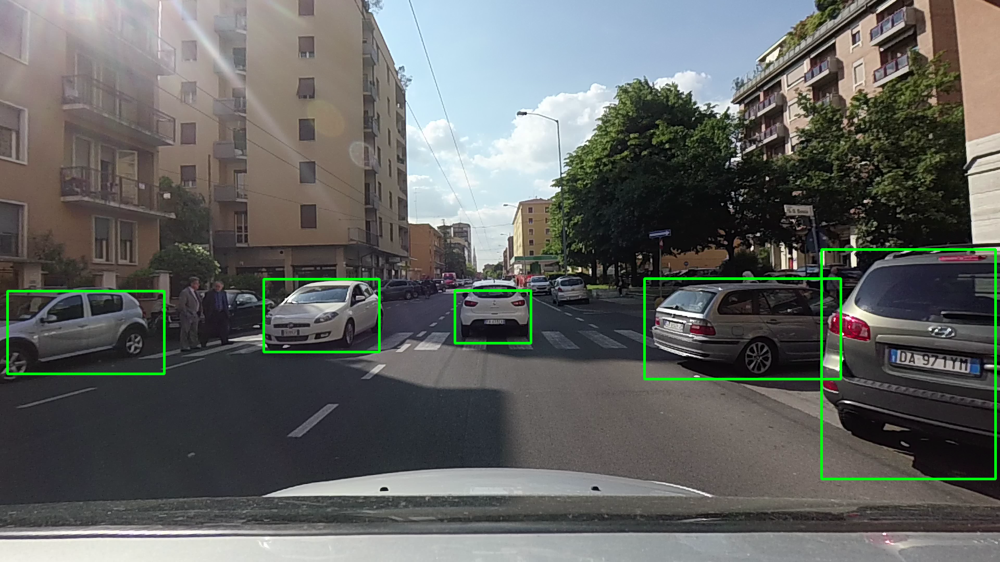

# Vehicle Detection Project

<p align="center">
 <a href="https://www.youtube.com/watch?v=Cd7p5pnP3e0"></a>
 <br>Qualitative results. (click for full video)
</p>

## [Rubric](https://review.udacity.com/#!/rubrics/513/view) Points

### Abstract

The goal of the project was to develop a pipeline to reliably detect cars given a video from a roof-mounted camera: in this readme the reader will find a short summary of how I tackled the problem.

**Long story short**:
 - (baseline) HOG features + linear SVM to detect cars, temporal smoothing to discard false positive
 - (submission) [SSD deep network](https://arxiv.org/pdf/1512.02325.pdf) for detection, thresholds on detection confidence and label to discard false positive 
 
*That said, let's go into details!*

### Good old CV: Histogram of Oriented Gradients (HOG)

#### 1. Feature Extraction.

In the field of computer vision, a *features* is a compact representation that encodes information that is relevant for a given task. In our case, features must be informative enough to distinguish between *car* and *non-car* image patches as accurately as possible.

Here is an example of how the `vehicle` and `non-vehicle` classes look like in this dataset:

<p align="center">
  
  <br>Randomly-samples non-car patches.
</p>

<p align="center">
  
  <br>Randomly-samples car patches.
</p>

The most of the code that relates to feature extraction is contained in [`functions_feat_extraction.py`](functions_feat_extraction.py). Nonetheless, all parameters used in the phase of feature extraction are stored as dictionary in [`config.py`](config.py), in order to be able to access them from anywhere in the project.

Actual feature extraction is performed by the function `image_to_features`, which takes as input an image and the dictionary of parameters, and returns the features computed for that image. In order to perform batch feature extraction on the whole dataset (for training), `extract_features_from_file_list` takes as input a list of images and return a list of feature vectors, one for each input image.

For the task of car detection I used *color histograms* and *spatial features* to encode the object visual appearence and HOG features to encode the object's *shape*. While color the first two features are easy to understand and implement, HOG features can be a little bit trickier to master.

#### 2. Choosing HOG parameters.

HOG stands for *Histogram of Oriented Gradients* and refer to a powerful descriptor that has met with a wide success in the computer vision community, since its [introduction](http://vc.cs.nthu.edu.tw/home/paper/codfiles/hkchiu/201205170946/Histograms%20of%20Oriented%20Gradients%20for%20Human%20Detection.pdf) in 2005 with the main purpose of people detection. 

<p align="center">
  
  <br>Representation of HOG descriptors for a car patch (left) and a non-car patch (right).
</p>

The bad news is, HOG come along with a *lot* of parameters to tune in order to work properly. The main parameters are the size of the cell in which the gradients are accumulated, as well as the number of orientations used to discretize the histogram of gradients. Furthermore, one must specify the number of cells that compose a block, on which later a feature normalization will be performed. Finally, being the HOG computed on a single-channel image, arises the need of deciding which channel to use, eventually computing the feature on all channels then concatenating the result.

In order to select the right parameters, both the classifier accuracy and computational efficiency are to consider. After various attemps, I came up to the following parameters that are stored in [`config.py`](config.py):
```
# parameters used in the phase of feature extraction
feat_extraction_params = {'resize_h': 64,             # resize image height before feat extraction
                          'resize_w': 64,             # resize image height before feat extraction
                          'color_space': 'YCrCb',     # Can be RGB, HSV, LUV, HLS, YUV, YCrCb
                          'orient': 9,                # HOG orientations
                          'pix_per_cell': 8,          # HOG pixels per cell
                          'cell_per_block': 2,        # HOG cells per block
                          'hog_channel': "ALL",       # Can be 0, 1, 2, or "ALL"
                          'spatial_size': (32, 32),   # Spatial binning dimensions
                          'hist_bins': 16,            # Number of histogram bins
                          'spatial_feat': True,       # Spatial features on or off
                          'hist_feat': True,          # Histogram features on or off
                          'hog_feat': True}           # HOG features on or off
```

#### 3. Training the classifier

Once decided which features to used, we can train a classifier on these. In [`train.py`](train.py) I train a linear SVM for task of binary classification *car* vs *non-car*. First, training data are listed a feature vector is extracted for each image:
```
    cars = get_file_list_recursively(root_data_vehicle)
    notcars = get_file_list_recursively(root_data_non_vehicle)

    car_features = extract_features_from_file_list(cars, feat_extraction_params)
    notcar_features = extract_features_from_file_list(notcars, feat_extraction_params)
``` 
Then, the actual training set is composed as the set of all car and all non-car features (labels are given accordingly). Furthermore, feature vectors are standardize in order to have all the features in a similar range and ease training.
```
    feature_scaler = StandardScaler().fit(X)  # per-column scaler
    scaled_X = feature_scaler.transform(X)
```
Now, training the LinearSVM classifier is as easy as:
```
    svc = LinearSVC()  # svc = SVC(kernel='rbf')
    svc.fit(X_train, y_train)
```
In order to have an idea of the classifier performance, we can make a prediction on the test set with `svc.score(X_test, y_test)`. Training the SVM with the features explained above took around 10 minutes on my laptop. 

### Sliding Window Search

#### 1. Describe how (and identify where in your code) you implemented a sliding window search.  How did you decide what scales to search and how much to overlap windows?

In a first phase, I implemented a naive sliding window approach in order to get windows at different scales for the purpose of classification. This is shown in function `compute_windows_multiscale` in [`functions_detection.py`](functions_detection.py). This turned out to be very slow. I utlimately implemented a function to jointly search the region of interest and to classify each window as suggested by the course instructor. The performance boost is due to the fact that HOG features are computed only once for the whole region of interest, then subsampled at different scales in order to have the same effect of a multiscale search, but in a more computationally efficient way. This function is called `find_cars` and implemented in [`functions_feat_extraction.py`](functions_feat_extraction.py). Of course the *tradeoff* is evident: the more the search scales and the more the overlap between adjacent windows, the less performing is the search from a computational point of view.

#### 2. Show some examples of test images to demonstrate how your pipeline is working.  What did you do to optimize the performance of your classifier?

Whole classification pipelin using CV approach is implemented in [`main_hog.py`](main_hog.py). Each test image undergoes through the `process_pipeline` function, which is responsbile for all phases: feature extraction, classification and showing the results.

<p align="center">
  
  <br>Result of HOG pipeline on one of the test images.
</p>

In order to optimize the performance of the classifier, I started the training with different configuration of the parameters, and kept the best one. Performing detection at different scales also helped a lot, even if exceeding in this direction can lead to very long computational time for a single image. At the end of this pipeline, the whole processing, from image reading to writing the ouput blend, took about 0.5 second per frame.

### Computer Vision on Steroids, a.k.a. Deep Learning

#### 1. SSD (*Single Shot Multi-Box Detector*) network

In order to solve the aforementioned problems, I decided to use a deep network to perform the detection, thus replacing the HOG+SVM pipeline. For this task employed the recently proposed  [SSD deep network](https://arxiv.org/pdf/1512.02325.pdf) for detection. This paved the way for several huge advantages:
 - the network performs detection and classification in a single pass, and natively goes in GPU (*is fast*)
 - there is no more need to tune and validate hundreds of parameters related to the phase of feature extraction (*is robust*)
 - being the "car" class in very common, various pretrained models are available in different frameworks (Keras, Tensorflow etc.) that are already able to nicely distinguish this class of objects (*no need to retrain*)
 - the network outputs a confidence level along with the coordinates of the bounding box, so we can decide the tradeoff precision and recall just by tuning the confidence level we want (*less false positive*) 
 
The whole pipeline has been adapted to the make use of SSD network in file [`main_ssd.py`](main_ssd.py).

### Video Implementation

#### 1. Provide a link to your final video output.  Your pipeline should perform reasonably well on the entire project video (somewhat wobbly or unstable bounding boxes are ok as long as you are identifying the vehicles most of the time with minimal false positives.)
Here's a [link to my video result](https://www.youtube.com/watch?v=Cd7p5pnP3e0)


#### 2. Describe how (and identify where in your code) you implemented some kind of filter for false positives and some method for combining overlapping bounding boxes.

In a first phase while I was still using HOG+SVM, I implemented a heatmap to average detection results from successive frames. The heatmap was thresholded to a minimum value before labeling regions, so to remove the major part of false positive. This process in shown in the thumbnails on the left of the previous figure.

When I turned to deep learning, as mentioned before I could rely on a *confidence score* to decide the tradeoff between precision and recall. The following figure shows the effect of thresholding SSD detection at different level of confidence. 

<table style="width:100%">
  <tr>
    <th>
      <p align="center">
           
           <br>SSD Network result setting minimum confidence = 0.01
      </p>
    </th>
    <th>
      <p align="center">
           
           <br>SSD Network result setting minimum confidence = 0.50
      </p>
    </th>
  </tr>
</table>

Actually, while using SSD network for detection for the project video I found that integrating detections over time was not only useless, but even detrimental for performance. Indeed, being detections very precide and false positive almost zero, there was no need anymore to carry on information from previous detections. 

---

### Discussion

#### 1. Briefly discuss any problems / issues you faced in your implementation of this project.  Where will your pipeline likely fail?  What could you do to make it more robust?

In the first phase, the HOG+SVM approach turned out to be slightly frustrating, in that strongly relied on the parameter chosed to perform feature extraction, training and detection. Even if I found a set of parameters that more or less worked for the project video, I wasn't satisfied of the result, because parameters were so finely tuned on the project video that certainly were not robust to different situations. 

For this reason, I turned to deep learning, and I leveraged on an existing detection network (pretrained on Pascal VOC classes) to tackle the problem. From that moment, the sun shone again on this assignment! :-)

### Acknowledgments

Implementation of [Single Shot MultiBox Detector](https://arxiv.org/pdf/1512.02325.pdf) was borrowed from [this repo](https://github.com/rykov8/ssd_keras) and then slightly modified for my purpose. Thank you [rykov8](https://github.com/rykov8) for porting this amazing network in Keras-Tensorflow!
